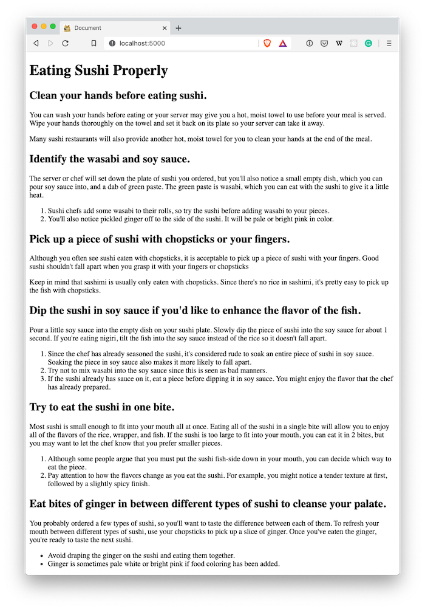

# 01 Exercise - 'How to Eat Sushi' HTML page with lists

Build an informative website using HTML headings, paragraphs and lists.

---

## Brief

Take the [Google Document](https://docs.google.com/document/d/1fPu6E18nfS024AOBzXMofrtbuHatZTwgRSlV2eJq4jY/edit?usp=sharing), and convert the text to semantic HTML, so it can be displayed on a website. The document includes headings, paragraphs, ordered and unordered lists.

When you have completed the exercise, you should have a website that looks like this:


---

## Rationale

HTML is the foundation of the internet, and web developers need to have an understanding of how to write HTML.

Web developers need to know what HTML tags mean, so they can represent their content correctly when marking up their text in HTML.

Search engines and other tools can read HTML, and derive meaning from the HTML to display search results.

---

## Getting Started

1. Accept the exercise with the exercise link from the class notes.
2. `clone` to your local computer using VS Code or the Terminal.
3. Read the exercise instructions completely before getting started.
4. The code for this exercise should go into the `/Submission/` folder.

---

## Instructions

This exercise involves converting a guide on _How to eat Sushi_ from a Google Document into meaningful HTML. You should have your HTML reference ready, so you know what HTML elements to use when writing your HTML.

1. Open the [Google Document](https://docs.google.com/document/d/1fPu6E18nfS024AOBzXMofrtbuHatZTwgRSlV2eJq4jY/edit?usp=sharing) to view the text you will be converting to HTML
2. Investigate the document, and identify the different styles of text that exist. Think about what HTML elements represent the type of content you can see.
3. In the `Submission` folder, create a new file, `index.html`. You can do this in VS Code, by opening File Explorer, and right-clicking on the `Submission` folder, then choosing `New File`. `index.html` is a very common name for the html page that you want to be considered as your 'home page'.
4. Open `index.html` by double-clicking it. You should have an empty file.
5. Build the base of your HTML page, including the `html`, `head`, and `body` tags. You can use the Emmet plugin that is built into VS Code to do this quickly, by typing `!` and then `tab`

   

   - Reference [Anatomy of an HTML document](https://developer.mozilla.org/en-US/docs/Learn/Getting_started_with_the_web/HTML_basics#Anatomy_of_an_HTML_document)

6. You should now have the basics of an HTML page. Let's test if it works, by right-clicking on your page in the VS Code Explorer, and clicking `Open with Live Server`. This should pop open your browser, and will show nothing.

   

7. Make sure your cursor is in the correct place in your HTML document, between the `body` tags.

   

8. Now it's time to write your HTML. Copy and paste the text from the [Google Document](https://docs.google.com/document/d/1fPu6E18nfS024AOBzXMofrtbuHatZTwgRSlV2eJq4jY/edit) into your HTML file. Then markup your text using HTML, using appropriate HTML tags to match the content type of the text.

   - Use your reference material to make sure you know about `ol`, `ul`, and `li` tags.

9. Once you have finished, open your website in your browser using Live Server. Check if it looks ok, and then submit your exercise.

---

# Submit your Exercise

- [ ] [Feedback](feedback.md) has been completed
- [ ] Commits are pushed to GitHub

---

<details>
  <summary>
    Git CLI Refresher
  </summary>

If you need help remembering what commands to type with `git`, use the following as a reference, or watch the [git walkthrough tutorial video](https://vimeo.com/433825571/bc1830fb90)

```shell
# when ready to commit and push
git add .

git commit -m "Completed Part A"

git push origin master
```

</details>
